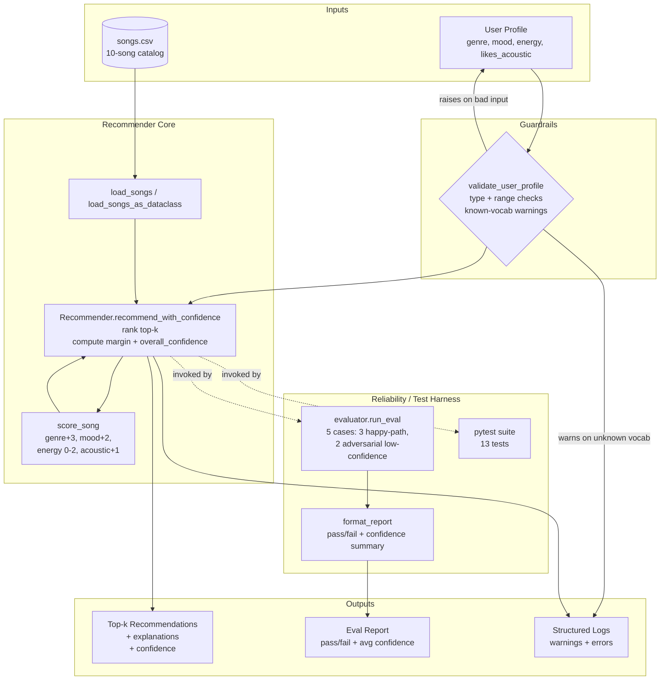

# Applied AI System — VibeFinder, with Reliability Harness

> **Base project:** This system is a direct extension of the **Music Recommender Simulation** built in Module 3 (`ai110-module3show-musicrecommendersimulation-starter`). The original project implemented a content-based scoring rule that ranked a 10-song catalog against a single user's stated taste. The original goal was to mirror, at a small scale, how Spotify-style recommenders combine genre, mood, and audio features into a ranked shortlist. This applied-AI extension keeps that core and wraps it in a **reliability and evaluation system** so the recommender's behavior can be tested, measured, and trusted.

---

## Title and Summary

**VibeFinder 1.1** — a transparent, content-based music recommender with input guardrails, confidence scoring, and an automated evaluation harness.

The point of this project is not just to recommend songs — it is to make the recommender's reliability **observable**. Every recommendation now carries a confidence score derived from the top match's strength and its margin over the second-best song. A standing evaluation suite exercises the system against five fixed user profiles (three "happy path" cases the system should nail; two adversarial cases where the system should report low confidence rather than pretending to know). This is the difference between an AI that *seems to work* and one that *can prove it works*.

---

## Architecture Overview

The system has four layers: **input guardrails** validate user profiles before they reach the model; the **recommender core** scores and ranks; the **evaluation harness** runs the recommender against expected outcomes and emits a pass/fail + confidence report; and **structured logs** capture warnings and errors throughout.



> Mermaid source is also stored at [`assets/architecture.mmd`](assets/architecture.mmd). GitHub renders the diagram inline; no PNG export is required.

**Where humans / testing check the AI:** the evaluation harness (`src/evaluator.py`) is the formal check — it asserts both *what the system recommends* and *how confident it claims to be*. The pytest suite (`tests/`) is the second check, exercising guardrails and edge cases. A human reviewer reads the eval report after every change to confirm adversarial cases still register as low-confidence rather than slipping into false certainty.

---

## Setup Instructions

```bash
# 1. Clone
git clone https://github.com/Arman-Chaudhury/applied-ai-system-final.git
cd applied-ai-system-final

# 2. Create a virtual environment
python3 -m venv .venv
source .venv/bin/activate          # macOS / Linux
# .venv\Scripts\activate           # Windows

# 3. Install dependencies
pip install -r requirements.txt

# 4. Run the recommender against the five built-in user profiles
python -m src.main

# 5. Run the evaluation harness (pass/fail + confidence report)
python -m src.evaluate

# 6. Run the test suite
pytest -v
```

The recommender depends only on the Python standard library; `pandas` and `streamlit` are listed in `requirements.txt` for compatibility with the original Module 3 project but are not required by the AI system.

---

## Sample Interactions

### Sample 1 — Strong match (`pop / happy / 0.8`)

```
Input:  UserProfile(favorite_genre="pop", favorite_mood="happy",
                    target_energy=0.8, likes_acoustic=False)

Top recommendation:  Sunrise City by Neon Echo
Score:               6.96 / 8.00
Margin over #2:      2.22
Overall confidence:  0.69
Reasons:             genre matches (pop), mood matches (happy),
                     energy closely matches (0.82)
```

The system recommends with high confidence because all three primary signals align and the runner-up is clearly behind.

### Sample 2 — Adversarial mismatch (`jazz / intense / 0.9`)

```
Input:  UserProfile(favorite_genre="jazz", favorite_mood="intense",
                    target_energy=0.9, likes_acoustic=False)

Top recommendation:  Storm Runner by Voltline   (rock, not jazz)
Score:               3.98 / 8.00
Margin over #2:      0.04
Overall confidence:  0.35
```

No song in the catalog is both jazz and intense. The system still returns a top pick — but its confidence drops to 0.35, and the top two contenders are nearly tied (margin = 0.04). This is exactly the behavior the evaluation harness asserts: the system must *know it does not know*.

### Sample 3 — Guardrail rejection (invalid input)

```python
>>> from src.recommender import validate_user_profile, ProfileValidationError
>>> validate_user_profile(
...     {"genre": "pop", "mood": "happy", "energy": 1.7, "likes_acoustic": False}
... )
ProfileValidationError: energy must be within [0, 1], got 1.7

>>> validate_user_profile(
...     {"genre": "k-pop", "mood": "happy", "energy": 0.6, "likes_acoustic": False}
... )
["genre 'k-pop' not in catalog vocabulary [...] — recommendations will rely on mood + energy only"]
```

Hard violations (out-of-range numbers, wrong types) raise immediately. Soft violations (genres or moods the catalog has never seen) come back as warnings, get logged, and ride along with the recommendation result so the caller can decide what to do.

---

## Design Decisions

- **Reliability as the primary AI feature, not a side effect.** A scoring rule alone is just arithmetic. Wrapping it in a guardrail + confidence + evaluation layer is what makes this an *applied AI system* — every recommendation can be inspected, the system can decline to be confident, and a single command (`python -m src.evaluate`) tells you whether behavior has regressed.
- **Confidence = 0.7 × top-score-ratio + 0.3 × normalized-margin.** A pure top-score metric would call the adversarial cases "confident" because the math is doing its job. A pure margin metric would call any close-fought decision "uncertain" even when both contenders are great. Blending the two penalizes the failure mode that actually matters: a low absolute score paired with no separation from the runner-up, which is the signature of an adversarial input.
- **Hard vs. soft guardrails.** Out-of-range numbers and wrong types block execution immediately because they indicate bugs upstream. Unknown genres or moods don't block — the catalog vocabulary is small and arbitrary, so a real user might reasonably ask for "k-pop" or "drill"; we just record a warning and let the energy/acoustic signals carry the decision.
- **Backward compatibility preserved.** `Recommender.recommend()`, `recommend_songs()`, and `score_song()` keep their original signatures so the Module 3 demo (`src/main.py`) continues to run unchanged. The new behavior lives behind `recommend_with_confidence()`.
- **Mermaid embedded in the README, not exported to PNG.** GitHub renders Mermaid natively; exporting to PNG would add a manual step that drifts out of date the moment the architecture changes. The `.mmd` source is also stored in `/assets` for editors that don't render Mermaid inline.
- **Trade-off accepted: the catalog stays at 10 songs.** Expanding the catalog would mask the genre-bias problem rather than solve it. Keeping the catalog small keeps the failure modes visible and gives the evaluation harness real adversarial cases to defend against.

---

## Testing Summary

**Automated coverage: 13 pytest tests across two files.**

```
tests/test_recommender.py — 8 tests
  - sort order, explanation output (carried over from Module 3)
  - confidence shape, margin math, unknown-genre warning
  - guardrails: out-of-range energy, wrong-type likes_acoustic, missing keys
  - rejects k=0
tests/test_evaluator.py — 5 tests
  - full default suite passes against the real catalog
  - strong-match case has confidence > 0.6
  - adversarial case has confidence < 0.55
  - report formatting includes the SUMMARY line
  - default suite covers both happy-path and adversarial paths
```

**Evaluation suite: 5 cases, 5 passing, average overall confidence 0.58.**

| Case | Top pick | Score | Confidence | Verdict |
|---|---|---|---|---|
| pop / happy / 0.8 | Sunrise City | 6.96 | 0.69 | PASS — strong match, clear margin |
| lofi / chill / 0.4 / acoustic | Midnight Coding | 7.96 | 0.70 | PASS — high score, narrow margin pulls confidence |
| rock / intense / 0.9 | Storm Runner | 6.98 | 0.72 | PASS — only rock song, perfect mood + energy |
| jazz / intense / 0.9 (adversarial) | Storm Runner | 3.98 | 0.35 | PASS — system correctly reports low confidence |
| ambient / relaxed / 0.9 / acoustic (adversarial) | Spacewalk Thoughts | 4.76 | 0.45 | PASS — energy mismatch surfaces as low confidence |

**What worked:** the confidence metric cleanly separated good answers from forced ones. The two adversarial cases dropped to 0.35 and 0.45 even though the recommender still returned a top pick — that is the entire point.

**What didn't:** the lofi case scored 7.96 / 8.00 (almost perfect) but its overall confidence came out at only ~0.70 because Library Rain trails Midnight Coding by just 0.06 points. The blended formula treats "two great answers neck and neck" as low-confidence, which is technically right but reads as a false alarm. A future iteration should treat margin differently when both contenders cross a quality threshold.

**What I learned:** evaluation isn't an add-on — it is what turns a scoring rule into a system you can ship. Without the harness, every code change would mean re-running `main.py` by eye and trusting that nothing regressed. With it, the next person to touch this code gets a one-line answer.

---

## Reflection

The biggest lesson from extending this project was that *making AI more reliable is mostly a software-engineering problem, not a modeling problem*. The scoring rule didn't change between Module 3 and this submission. What changed was the surface area around it: guardrails on the input, confidence on the output, a harness that asserts behavior, and logs that explain it. Each of those is a few dozen lines of plain Python — no neural network, no fine-tuning — and yet the overall system is dramatically more trustworthy than the original.

This project also forced a sharper view of what "confidence" should mean. My first instinct was `confidence = top_score / max_score`, but that gave the adversarial cases scores around 0.5 — too high to be useful. Switching to the blended formula (top-score weight + margin weight) was the moment the system started behaving like something that *knows when it doesn't know*. That distinction — between "produces an output" and "produces an output and reports its uncertainty" — is what separates a demo from a system you'd let near a real user.

Where human judgment still matters: deciding which user profiles count as "adversarial enough" to test against, picking the confidence thresholds (the numbers in `EvalCase`), and reading the eval report after every change. The harness automates the check, but it doesn't decide what to check for.

Full reflection — limitations, biases, misuse risks, and AI-collaboration retrospective — lives in [`model_card.md`](model_card.md).

---

## Repository Layout

```
applied-ai-system-final/
├── README.md                # this file
├── model_card.md            # reflections on limitations, bias, misuse, AI collaboration
├── reflection.md            # original Module 3 reflection (preserved for context)
├── requirements.txt
├── assets/
│   └── architecture.mmd     # Mermaid source for the system diagram
├── data/
│   └── songs.csv            # 10-song catalog
├── src/
│   ├── __init__.py
│   ├── main.py              # original Module 3 demo (5 profiles + weight-shift experiment)
│   ├── recommender.py       # core scoring + guardrails + confidence
│   ├── evaluator.py         # evaluation harness (cases, runner, report)
│   └── evaluate.py          # CLI entry point: `python -m src.evaluate`
└── tests/
    ├── __init__.py
    ├── test_recommender.py
    └── test_evaluator.py
```
